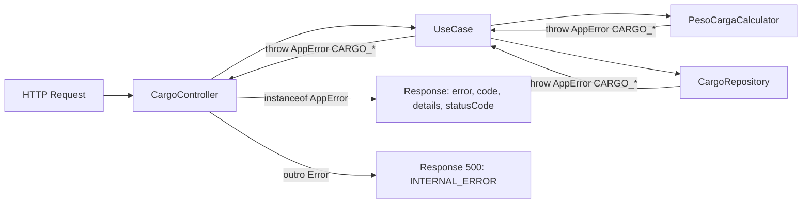

# Cargo - Padronização de Erros com AppError

> Issue de origem: [#14 - refactor: padronizar erros do domínio cargo com AppError](https://github.com/Gabr1elaugus700/WorkaPool/issues/14)

## Problem Statement

O domínio `cargo` lança `Error` genérico em **17 pontos** distribuídos por 11 arquivos (use cases, repository e service). O `CargoController` trata erros de forma heterogênea: alguns métodos já reconhecem `AppError` (ex.: `closeCarga`, `updateSituacao`, `updateCarga`, `updatePedidoCarga`, `getCargasFechadas`), mas outros 5 (`createCarga`, `getCargaById`, `updatePedido`, `getPedidos`, `getPedidosPorCarga`) ainda devolvem `error.message` cru com status `500`.

Como consequência:

1. O frontend recebe um contrato de erro inconsistente entre rotas — sem `code` nem `statusCode` semântico.
2. Um "Carga não encontrada" devolve `500` em vez de `404`, distorcendo monitoramento e UX.
3. Discriminar erros para i18n/UX exige parsear `error.message`, o que é frágil.

A solução é replicar o padrão `AppError({ message, statusCode, code, details })` já consolidado em `[backend/src/utils/AppError.ts](../../../backend/src/utils/AppError.ts)` e usado de forma exemplar em `[backend/src/features/orderLoss/http/controllers/OrdersController.ts](../../../backend/src/features/orderLoss/http/controllers/OrdersController.ts)`.

## Goals

- Eliminar 100% dos `throw new Error(...)` de erro de negócio/validação no domínio `cargo`.
- Devolver `{ error, code, details }` com `statusCode` correto em todas as rotas de cargo.
- Manter mensagens em PT-BR (compatibilidade com a UI atual).
- Adotar prefixo `CARGO_` em todos os `code` para evitar colisão com outros domínios.

## Out of Scope

- Mudanças em regras de negócio do domínio cargo.
- Renomear endpoints, alterar payload de sucesso ou shape de queries.
- Refatorar `CreateCarga.use-case.ts`, `GetCargasFechadas.use-case.ts`, `CargaProcessor.ts` e demais arquivos do cargo que **não** lançam `Error` hoje (não estão na issue).
- Criar middleware global de tratamento de erro (segue try/catch por método como hoje).
- Reescrever testes do domínio cargo (somente ajustar asserts caso quebrem).

## User Stories

### P1: CESS-01 — Use cases lançam AppError tipado

**User Story**: Como consumidor (controller/frontend) das rotas de cargo, eu quero que os use cases lancem `AppError` com `statusCode`, `code` e `details` estruturados, para que eu possa discriminar erros sem parsear `error.message`.

**Why P1**: É o coração do refactor; sem esse passo os ACs da issue não fecham.

**Acceptance Criteria**:

1. WHEN um use case do cargo encontra erro de validação de input THEN ele SHALL lançar `AppError` com `statusCode: 400` e `code` prefixado com `CARGO_`.
2. WHEN um use case não encontra um recurso (carga, pedido, histórico) THEN ele SHALL lançar `AppError` com `statusCode: 404` e `code` específico (`CARGO_NOT_FOUND`, `CARGO_HISTORICO_PESO_NOT_FOUND`, `CARGO_PESO_PEDIDO_NOT_FOUND`).
3. WHEN um use case detecta violação de regra de negócio (ex.: fechar carga sem pedidos) THEN ele SHALL lançar `AppError` com `statusCode: 409` e `code` específico.
4. WHEN um `AppError` é lançado THEN o campo `details` SHALL conter um objeto com os identificadores envolvidos (ex.: `{ codCar }`, `{ numPed }`) para permitir debugging sem parse de string.

**Independent Test**: Disparar uma chamada com `codCar` ausente em qualquer use case afetado e verificar que o erro propagado é `AppError` com `code` `CARGO_`* e `statusCode` `400`.

---

### P2: CESS-02 — Repository e Service lançam AppError tipado

**User Story**: Como mantenedor do domínio cargo, eu quero que o `CargoRepository` e o `PesoCargaCalculator` também usem `AppError`, para que erros levantados em camadas inferiores cheguem ao controller já com o contrato correto.

**Why P2**: Sem isso, o controller continuaria recebendo `Error` genérico vindo do repository/service e cairia no fallback 500 mesmo após o trabalho em CESS-01.

**Acceptance Criteria**:

1. WHEN `CargoRepository` ou `PesoCargaCalculator` detectam falha de domínio (carga não encontrada, peso inválido, pedido não atualizado) THEN SHALL lançar `AppError`.
2. WHEN `CargoRepository.getPedidosPorCarga` é chamado sem `pedidosRepository` injetado THEN SHALL lançar `AppError({ statusCode: 500, code: "CARGO_REPOSITORY_NOT_INITIALIZED", isOperational: false })` para sinalizar erro de programação (não operacional).
3. WHEN `PesoCargaCalculator` recebe peso `null`/`NaN` THEN SHALL lançar `AppError({ statusCode: 422, code: "CARGO_PESO_PEDIDO_INVALIDO" })`.

**Independent Test**: Instanciar `CargoRepository` sem `pedidosRepository` e chamar `getPedidosPorCarga`; confirmar `AppError` com `isOperational: false`.

---

### P3: CESS-03 — Controller responde contrato uniforme

**User Story**: Como cliente HTTP (frontend ou serviço), eu quero que **todos** os endpoints do `CargoController` respondam com o mesmo shape de erro `{ error, code, details }` e `statusCode` correto, para tratar falhas de forma consistente.

**Why P3**: Cumpre o AC#3 da issue ("Contratos de erro retornados por controllers consumidores ficam consistentes com o padrão do OrdersController").

**Acceptance Criteria**:

1. WHEN qualquer método do `CargoController` captura um `AppError` THEN SHALL responder `res.status(err.statusCode).json({ error: err.message, code: err.code, details: err.details })`.
2. WHEN qualquer método do `CargoController` captura um erro que **não** é `AppError` THEN SHALL responder `res.status(500).json({ error: "<mensagem PT-BR contextual>", code: "INTERNAL_ERROR" })`.
3. WHEN os 5 métodos hoje sem suporte a `AppError` (`createCarga`, `getCargaById`, `updatePedido`, `getPedidos`, `getPedidosPorCarga`) são chamados em cenário de erro THEN o response SHALL seguir o mesmo shape dos demais métodos do controller.

**Independent Test**: Chamar `GET /cargas/:id` com `id` inexistente e verificar response `404 { error, code: "CARGO_NOT_FOUND", details: { codCar } }`.

---

## Edge Cases

- **Erro de programação não-operacional**: `CARGO_REPOSITORY_NOT_INITIALIZED` usa `isOperational: false` para sinalizar que não deve poluir métricas operacionais (alinhado ao contrato do `AppError`).
- `**UpdatePedidoCarga.use-case.ts` linha 34**: o `throw` está dentro de um `try/catch` interno que **engole o erro** intencionalmente (gravar histórico de peso é best-effort). O comportamento é preservado — apenas troca-se `Error` por `AppError` por consistência caso o catch interno seja removido futuramente.
- **Mensagens em PT-BR**: todas as mensagens permanecem em PT-BR para não quebrar UI/labels já existentes.
- `**details` sempre estruturado**: nunca apenas duplicar a `message` em `details`; preferir objeto com identificadores (`{ codCar }`, `{ numPed }`, `{ codCar, situacao }`).
- **Imports**: cada arquivo afetado precisará importar `AppError` de `../../../utils/AppError` (use cases/services) ou `../../../../utils/AppError` (controller) — confirmar profundidade ao editar.

## Catálogo de Erros (mapa completo de 17 throws)


| #   | Origem                                                                                                                           | Mensagem atual (`Error`)                                                               | `message` (`AppError`)                                         | `statusCode` | `code`                                  | `details`                                                       |
| --- | -------------------------------------------------------------------------------------------------------------------------------- | -------------------------------------------------------------------------------------- | -------------------------------------------------------------- | ------------ | --------------------------------------- | --------------------------------------------------------------- |
| 1   | `[CloseCarga.use-case.ts:32](../../../backend/src/features/cargo/useCases/CloseCarga.use-case.ts)`                               | `"Código da carga é obrigatório"`                                                      | `"Código da carga é obrigatório"`                              | 400          | `CARGO_COD_CAR_REQUIRED`                | `{ codCar }`                                                    |
| 2   | `[CloseCarga.use-case.ts:37](../../../backend/src/features/cargo/useCases/CloseCarga.use-case.ts)`                               | `Carga com código ${codCar} não encontrada`                                            | `Carga ${codCar} não encontrada`                               | 404          | `CARGO_NOT_FOUND`                       | `{ codCar }`                                                    |
| 3   | `[CloseCarga.use-case.ts:42](../../../backend/src/features/cargo/useCases/CloseCarga.use-case.ts)`                               | `Carga ${codCar} não possui pedidos vinculados`                                        | mesma                                                          | 409          | `CARGO_SEM_PEDIDOS_VINCULADOS`          | `{ codCar }`                                                    |
| 4   | `[CloseCarga.use-case.ts:57](../../../backend/src/features/cargo/useCases/CloseCarga.use-case.ts)`                               | `Os seguintes pedidos não estão vinculados a nenhuma carga no sistema Sapiens: ${...}` | mesma                                                          | 409          | `CARGO_PEDIDOS_FORA_DO_SAPIENS`         | `{ codCar, pedidos: pedidosSemCarga }`                          |
| 5   | `[UpdateCarga.use-case.ts:15](../../../backend/src/features/cargo/useCases/UpdateCarga.use-case.ts)`                             | `Carga ${id} não encontrada.`                                                          | mesma                                                          | 404          | `CARGO_NOT_FOUND`                       | `{ id }`                                                        |
| 6   | `[UpdateCargaSituacao.use-case.ts:13](../../../backend/src/features/cargo/useCases/UpdateCargaSituacao.use-case.ts)`             | `"Código da carga e situação são obrigatórios"`                                        | mesma                                                          | 400          | `CARGO_UPDATE_SITUACAO_DATA_REQUIRED`   | `{ codCar, situacao }`                                          |
| 7   | `[GetCargaById.use-case.ts:11](../../../backend/src/features/cargo/useCases/GetCargaById.use-case.ts)`                           | `"Código da carga é obrigatório"`                                                      | mesma                                                          | 400          | `CARGO_COD_CAR_REQUIRED`                | `{ codCar }`                                                    |
| 8   | `[GetCargaById.use-case.ts:15](../../../backend/src/features/cargo/useCases/GetCargaById.use-case.ts)`                           | `"Carga não encontrada"`                                                               | `Carga ${codCar} não encontrada`                               | 404          | `CARGO_NOT_FOUND`                       | `{ codCar }`                                                    |
| 9   | `[UpdatePedidoCarga.use-case.ts:16](../../../backend/src/features/cargo/useCases/UpdatePedidoCarga.use-case.ts)`                 | `"Dados obrigatórios ausentes"`                                                        | `"Dados obrigatórios ausentes para atualizar pedido na carga"` | 400          | `CARGO_PEDIDO_DATA_REQUIRED`            | `{ numPed, codCar, posCar }`                                    |
| 10  | `[UpdatePedidoCarga.use-case.ts:34](../../../backend/src/features/cargo/useCases/UpdatePedidoCarga.use-case.ts)`                 | `Carga ${codCar} não encontrada`                                                       | mesma                                                          | 404          | `CARGO_NOT_FOUND`                       | `{ codCar }`                                                    |
| 11  | `[GetPedidosCarga.use-case.ts:12](../../../backend/src/features/cargo/useCases/GetPedidosCarga.use-case.ts)`                     | `"Código da carga é obrigatório"`                                                      | mesma                                                          | 400          | `CARGO_COD_CAR_REQUIRED`                | `{ codCar }`                                                    |
| 12  | `[GetUltimoPesoPedido.use-case.ts:13](../../../backend/src/features/cargo/useCases/GetUltimoPesoPedido.use-case.ts)`             | `Histórico do pedido ${numPed} não encontrado.`                                        | mesma                                                          | 404          | `CARGO_HISTORICO_PESO_NOT_FOUND`        | `{ numPed }`                                                    |
| 13  | `[GetWeightPedido.use-case.ts:13](../../../backend/src/features/cargo/useCases/GetWeightPedido.use-case.ts)`                     | `Peso do pedido ${numPed} não encontrado.`                                             | mesma                                                          | 404          | `CARGO_PESO_PEDIDO_NOT_FOUND`           | `{ numPed }`                                                    |
| 14  | `[CreateHistoricoPesoPedido.use-case.ts:13](../../../backend/src/features/cargo/useCases/CreateHistoricoPesoPedido.use-case.ts)` | `Histórico do pedido ${numPed} não encontrado.`                                        | mesma                                                          | 404          | `CARGO_HISTORICO_PESO_NOT_FOUND`        | `{ numPed }`                                                    |
| 15  | `[CargoRepository.ts:76](../../../backend/src/features/cargo/repositories/CargoRepository.ts)`                                   | `Carga ${codCar} não encontrada`                                                       | mesma                                                          | 404          | `CARGO_NOT_FOUND`                       | `{ codCar }`                                                    |
| 16  | `[CargoRepository.ts:83](../../../backend/src/features/cargo/repositories/CargoRepository.ts)`                                   | `Carga ${codCar} não possui pedidos para ser fechada`                                  | mesma                                                          | 409          | `CARGO_SEM_PEDIDOS_VINCULADOS`          | `{ codCar }`                                                    |
| 17  | `[CargoRepository.ts:160](../../../backend/src/features/cargo/repositories/CargoRepository.ts)`                                  | `"Repositório de pedidos não inicializado"`                                            | mesma                                                          | 500          | `CARGO_REPOSITORY_NOT_INITIALIZED`      | `{ method: "getPedidosPorCarga" }` (com `isOperational: false`) |
| 18  | `[CargoRepository.ts:223](../../../backend/src/features/cargo/repositories/CargoRepository.ts)`                                  | `Pedido ${numPed} não encontrado ou não pôde ser atualizado.`                          | mesma                                                          | 404          | `CARGO_PEDIDO_NOT_FOUND_OR_NOT_UPDATED` | `{ numPed, codCar, posCar }`                                    |
| 19  | `[PesoCargaCalculator.ts:33](../../../backend/src/features/cargo/services/PesoCargaCalculator.ts)`                               | `Carga ${cargaId} não encontrada`                                                      | mesma                                                          | 404          | `CARGO_NOT_FOUND`                       | `{ cargaId }`                                                   |
| 20  | `[PesoCargaCalculator.ts:92](../../../backend/src/features/cargo/services/PesoCargaCalculator.ts)`                               | `Peso atual inválido para o pedido ${pedido.numPed}`                                   | mesma                                                          | 422          | `CARGO_PESO_PEDIDO_INVALIDO`            | `{ numPed: pedido.numPed, peso: pesoAtualPedido }`              |
| 21  | `[PesoCargaCalculator.ts:130](../../../backend/src/features/cargo/services/PesoCargaCalculator.ts)`                              | `Pedido ${novoPedido.numPed} com peso inválido: ${pesoPedido}`                         | mesma                                                          | 422          | `CARGO_PESO_PEDIDO_INVALIDO`            | `{ numPed: novoPedido.numPed, peso: pesoPedido }`               |


> Observação: a issue mencionou 17 throws no escopo. A varredura completa via `rg "throw new Error" backend/src/features/cargo` encontrou 21 ocorrências nos arquivos listados (a issue subdimensionou). Todas as 21 estão cobertas pela tabela acima.

### Códigos consolidados (catálogo final)


| `code`                                  | Status                       | Quando                                                  |
| --------------------------------------- | ---------------------------- | ------------------------------------------------------- |
| `CARGO_COD_CAR_REQUIRED`                | 400                          | `codCar` ausente em uso de caso                         |
| `CARGO_UPDATE_SITUACAO_DATA_REQUIRED`   | 400                          | `codCar` ou `situacao` ausentes em update de situação   |
| `CARGO_PEDIDO_DATA_REQUIRED`            | 400                          | `numPed`/`codCar`/`posCar` ausentes em update de pedido |
| `CARGO_NOT_FOUND`                       | 404                          | Carga não localizada                                    |
| `CARGO_HISTORICO_PESO_NOT_FOUND`        | 404                          | Sem histórico de peso para o pedido                     |
| `CARGO_PESO_PEDIDO_NOT_FOUND`           | 404                          | Sem peso atual para o pedido                            |
| `CARGO_PEDIDO_NOT_FOUND_OR_NOT_UPDATED` | 404                          | UPDATE no SQL Server retornou 0 rows                    |
| `CARGO_SEM_PEDIDOS_VINCULADOS`          | 409                          | Tentativa de fechar carga sem pedidos                   |
| `CARGO_PEDIDOS_FORA_DO_SAPIENS`         | 409                          | Pedidos sem carga correspondente no Sapiens             |
| `CARGO_PESO_PEDIDO_INVALIDO`            | 422                          | Peso `null` ou `NaN`                                    |
| `CARGO_REPOSITORY_NOT_INITIALIZED`      | 500 (`isOperational: false`) | `pedidosRepository` não injetado                        |
| `INTERNAL_ERROR`                        | 500                          | Fallback do controller para erros não-`AppError`        |


## Controller Catch Blocks (5 métodos a alinhar)

Métodos em `[CargoController.ts](../../../backend/src/features/cargo/http/controllers/CargoController.ts)` que **ainda não** reconhecem `AppError`:


| Método                       | Linhas atuais | Fallback message PT-BR                      |
| ---------------------------- | ------------- | ------------------------------------------- |
| `createCarga`                | 31-35         | `"Erro interno ao criar carga"`             |
| `getCargaById`               | 46-50         | `"Erro interno ao buscar carga"`            |
| `updatePedido` (rota antiga) | 103-109       | `"Erro interno ao atualizar pedido"`        |
| `getPedidos`                 | 129-135       | `"Erro interno ao buscar pedidos fechados"` |
| `getPedidosPorCarga`         | 284-290       | `"Erro interno ao buscar pedidos da carga"` |


Padrão a aplicar (idêntico ao já usado em `closeCarga`/`updateSituacao`/`updateCarga`/`updatePedidoCarga`/`getCargasFechadas`):

```typescript
} catch (err: unknown) {
  if (err instanceof AppError) {
    return res.status(err.statusCode).json({
      error: err.message,
      code: err.code,
      details: err.details,
    });
  }
  return res.status(500).json({ error: "<msg PT-BR contextual>", code: "INTERNAL_ERROR" });
}
```

> Observação: `updatePedido` (linha ~85) e `updatePedidoCarga` (linha ~229) são métodos distintos no controller — ambos devem responder de forma uniforme, mas só o primeiro precisa de ajuste neste refactor.

## Acceptance Criteria (issue #14)

- **AC1**: Nenhum `throw new Error(...)` permanece nos 11 arquivos do escopo para erros de negócio/validação. Verificável via `rg "throw new Error" backend/src/features/cargo` retornar 0 matches.
- **AC2**: Erros de negócio/validação passam a lançar `AppError` com `message`, `statusCode`, `code` e `details` populados.
- **AC3**: Os 5 métodos do `CargoController` listados acima reconhecem `AppError` no catch e devolvem `{ error, code, details }`, mantendo fallback `INTERNAL_ERROR` para erros desconhecidos.
- **AC4**: Compilação TypeScript (`tsc --noEmit` ou build do backend) passa sem novos erros.

## Requirement Traceability


| Requirement ID | Story                                     | Arquivos afetados                                                                                                                                                                                                                                                                             | Phase   | Status  |
| -------------- | ----------------------------------------- | --------------------------------------------------------------------------------------------------------------------------------------------------------------------------------------------------------------------------------------------------------------------------------------------- | ------- | ------- |
| CESS-01        | P1: Use cases lançam AppError             | `CloseCarga.use-case.ts`, `UpdateCarga.use-case.ts`, `UpdateCargaSituacao.use-case.ts`, `GetCargaById.use-case.ts`, `UpdatePedidoCarga.use-case.ts`, `GetPedidosCarga.use-case.ts`, `GetUltimoPesoPedido.use-case.ts`, `GetWeightPedido.use-case.ts`, `CreateHistoricoPesoPedido.use-case.ts` | Specify | Pending |
| CESS-02        | P2: Repository e Service lançam AppError  | `CargoRepository.ts`, `PesoCargaCalculator.ts`                                                                                                                                                                                                                                                | Specify | Pending |
| CESS-03        | P3: Controller responde contrato uniforme | `CargoController.ts` (5 métodos)                                                                                                                                                                                                                                                              | Specify | Pending |


## Success Criteria

- Para cada erro do catálogo, uma requisição que dispare a condição retorna o `statusCode` e `code` previstos (verificável manualmente via `curl`/Postman ou via testes).
- Frontend pode discriminar erros por `code` (não mais por substring de `message`).
- Comportamento de sucesso (200/201) permanece idêntico — sem regressão funcional.
- `rg "throw new Error" backend/src/features/cargo` retorna 0 matches após o refactor.

## Fluxo padronizado (visão geral)




