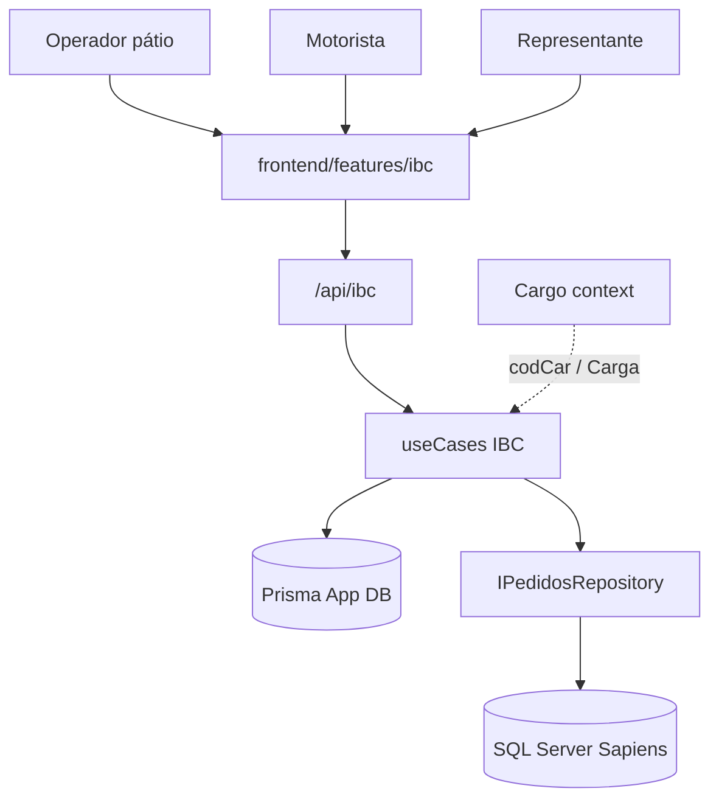
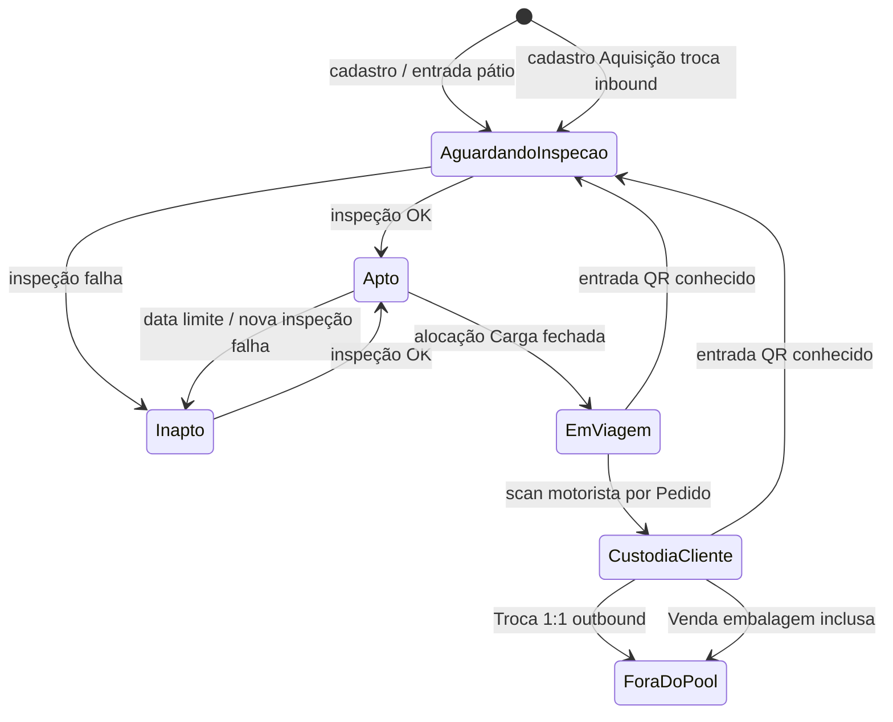

# IBC — Design de desenvolvimento

**Spec**: `.specs/features/ibc/spec.md`  
**Domínio**: `backend/src/features/ibc/CONTEXT.md`  
**Status**: Draft

---

## Architecture Overview

Novo bounded context **IBC** no monólito WorkaPool, espelhando o vertical slice de **Cargo**:

- **App DB (Prisma)**: agregados locais — IBC, movimentos, inspeções, alocações, avisos
- **ERP Sapiens (SQL)**: leitura de Carga/Pedidos/itens — estender Pedidos kernel com Código de embalagem, Volume, Embalagem inclusa, Representante (codRep)
- **Frontend**: `frontend/src/features/ibc` (web app mobile-friendly para motorista/pátio)



### Custódia (máquina de estados)



---

## Code Reuse Analysis

### Existing Components to Leverage

| Component | Location | How to Use |
| --------- | -------- | ---------- |
| Feature slice Cargo | `backend/src/features/cargo/` | Mirror folders: entities, useCases, http, repositories, types |
| Auth + roles | `authMiddleware`, `requireRoles` | Route guards; actor tipo `IbcActor` |
| AppError | `backend/src/utils/AppError.ts` | Erros tipados `{ error, code, details }` |
| Pedidos kernel | `backend/src/features/pedidos/` | Estender queries/mappers — **não** dono do Pedido |
| Cargo FE | `frontend/src/features/cargo/` | permissions, pages finas, services |
| Prisma | `backend/prisma/` | Novos models + migration |

### Integration Points

| System | Method |
| ------ | ------ |
| Carga | Referência por `codCar`; listar Cargas existentes (Cargo/Sapiens) para alocação e descarga |
| Pedido item | Novos campos SQL: código embalagem, Volume, embalagem inclusa (nomes ERP a confirmar no Sapiens) |
| Representante | `codRep` do Pedido → User / aviso in-app |
| QR | URL autenticada para ficha do IBC (P2) |

### Gaps (não existem hoje)

| Gap | Abordagem v1 |
| --- | ------------ |
| Código embalagem / Volume / embalagem inclusa nas queries | Estender `pedidosQueries` + types; validar nomes de coluna no Sapiens antes de codar |
| Sistema de notificação | Tabela `IbcAviso` + UI de avisos; sem email/push |
| Role MOTORISTA | Incluir no enum Prisma `Role` + migration + cadastro de User |
| Módulo IBC | Greenfield |
| Catálogo de checklist | Tabela `IbcChecklistItem` + seed dos fatores atuais do POP |

---

## Components

### IbcRegistry (cadastro + ficha)

- **Purpose**: CRUD de identidade do ativo (identificador, QR payload, aquisição, data limite)
- **Location**: `backend/src/features/ibc/useCases/` + `entities/`
- **Interfaces** (conceitual):
  - `cadastrarIbc(input): Ibc`
  - `obterPorIdentificador(id): Ibc`
- **Dependencies**: Prisma; gera identificador único
- **Reuses**: AppError, padrão use-case Cargo

### IbcInspecaoService

- **Purpose**: Registrar inspeção: para cada **Item de checklist ativo**, gravar score 0–10; calcular Aptidão (regra híbrida usando flag `critico` do item)
- **Location**: `backend/src/features/ibc/services/`
- **Interfaces**:
  - `listarItensAtivos(): ChecklistItem[]`
  - `registrarInspecao(ibcId, respostas: { checklistItemId, score, observacao? }[]): Aptidão`
- **Dependencies**: catálogo `IbcChecklistItem`; thresholds em config de domínio
- **Reuses**: histórico append-only; itens desativados não entram em inspeções novas, mas respostas antigas permanecem

### IbcChecklistAdmin

- **Purpose**: Cadastro de fatores/perguntas do POP de qualidade (CRUD do catálogo)
- **Location**: useCases + tela admin/pátio
- **Interfaces**:
  - `criarItem / atualizarItem / desativarItem`
- **Dependencies**: Prisma `IbcChecklistItem`
- **Reuses**: seed inicial com os fatores atuais (coloração, registro, bolsa, pés/base, tampa, grade)

### IbcAlocacaoCarga

- **Purpose**: Vincular IBCs Aptos a `codCar`; fechar → Em viagem
- **Location**: useCases + repository
- **Interfaces**:
  - `alocar(codCar, ibcIds[]): void`
  - `fecharAlocacao(codCar): void`
- **Dependencies**: leitura de Carga; bloqueio se Inapto
- **Reuses**: integração com dados de Cargo/Pedidos

### IbcDescargaMotorista

- **Purpose**: Por Cliente/Pedido com IBC, registrar scans → Custódia; inferir Venda vs Empréstimo
- **Location**: useCases + http (mobile UI)
- **Interfaces**:
  - `listarPedidosComIbc(codCar, clienteId): PedidoIbcView[]`
  - `confirmarCustodia(codCar, numPed, ibcIds[]): void`
- **Dependencies**: Pedidos (embalagem, Volume, embalagem inclusa, codRep)
- **Reuses**: PedidosRepository estendido

### IbcEntradaPatio

- **Purpose**: Entrada mista — QR conhecido ou Troca 1:1 com Pendentes de retorno
- **Location**: useCases
- **Interfaces**:
  - `entradaPorQr(codCar, identificador): void` → Aguardando inspeção
  - `cadastrarTroca(codCar, outboundId, novoIbc): void` → link 1:1, outbound fora do pool
  - `listarPendentesRetorno(codCar): Ibc[]`
- **Dependencies**: IbcRegistry, alocação/custódia da viagem

### IbcAvisoService

- **Purpose**: Criar/listar/marcar lido Aviso ao Representante
- **Location**: useCases + Prisma `IbcAviso`
- **Interfaces**:
  - `gerarAvisosPosViagem(codCar): void`
  - `listarPorRepresentante(codRep): Aviso[]`
- **Dependencies**: Pedido.codRep; IBCs ainda em Custódia após fechamento da entrada

### Frontend feature `ibc`

- **Purpose**: Telas pátio (cadastro, alocação, entrada, inspeção, alertas), motorista (descarga), representante (avisos)
- **Location**: `frontend/src/features/ibc/`
- **Reuses**: padrão cargo (services, permissions, PrivateRoute)

---

## Data Models (Prisma — conceitual)

```typescript
// Identidade do ativo
interface Ibc {
  id: string
  identificador: string // ex. H030 — unique
  aquisicao: "compra" | "troca"
  dataLimiteUso: Date
  aptidao: "apto" | "inapto"
  motivoInapto: "inspecao" | "data_limite" | "aguardando_inspecao" | null
  custodia: "patio" | "em_viagem" | "cliente" | "fora_pool"
  clienteId: string | null
  numPed: number | null
  prazoDevolucao: Date | null // Empréstimo
  modalidadeAtual: "nenhuma" | "emprestimo" | "venda" | "transbordo" | "troca" | null
  createdAt: Date
}

interface IbcChecklistItem {
  id: string
  fator: string // ex. "COLORAÇÃO", "REGISTRO"
  ensaio: string // texto do POP / pergunta a monitorar
  critico: boolean // true → piso rígido na regra híbrida (ex. registro, bolsa, base)
  ordem: number
  ativo: boolean // false = não aparece em novas inspeções; histórico preservado
  createdAt: Date
}

interface IbcInspecao {
  id: string
  ibcId: string
  resultado: "apto" | "inapto"
  createdAt: Date
  createdBy: number // user id
  // respostas: IbcInspecaoResposta[]  (1:N)
}

interface IbcInspecaoResposta {
  id: string
  inspecaoId: string
  checklistItemId: string // FK → IbcChecklistItem
  score: number // 0–10
  observacao: string | null
}

interface IbcAlocacaoCarga {
  id: string
  codCar: number
  ibcId: string
  fechadaEm: Date | null
}

interface IbcMovimento {
  id: string
  ibcId: string
  tipo:
    | "alocacao"
    | "custodia_cliente"
    | "entrada"
    | "troca_out"
    | "troca_in"
    | "venda"
  codCar: number | null
  numPed: number | null
  clienteId: string | null
  ibcVinculadoId: string | null // Troca 1:1
  createdAt: Date
}

interface IbcAviso {
  id: string
  codRep: number
  numPed: number
  codCar: number
  clienteId: string
  ibcIds: string[]
  lido: boolean
  createdAt: Date
}
```

**Relationships**:
- IBC 1—N Inspeções, Movimentos, Alocações
- **ChecklistItem 1—N Respostas**; Inspeção 1—N Respostas (vínculo do POP à inspeção)
- Inspeção nova exige resposta para **todos** os ChecklistItems com `ativo = true`
- Troca: movimento `troca_in` referencia `ibcVinculadoId` (outbound)
- Aviso N—IBCs (snapshot de ids)

**Pedidos (ERP — leitura)**: estender item com:

| Conceito domínio | Uso |
| ---------------- | --- |
| Código de embalagem | Filtrar Pedido com IBC (ex. `251004`) |
| Volume | Quantidade esperada de IBC |
| Embalagem inclusa | Venda vs Empréstimo |

> **Incerto até mapear Sapiens**: nomes físicos das colunas. Design bloqueia implementação de IBC-04 até discovery SQL (flag abaixo).

---

## Error Handling Strategy

| Scenario | Handling | User impact |
| -------- | -------- | ----------- |
| Alocar IBC Inapto | AppError 409 / código domínio | Mensagem clara + id do IBC |
| Scan IBC fora da Carga | AppError 422 | Motorista vê rejeição |
| Troca sem pendente | AppError 422 | Lista vazia / escolha inválida |
| Pedido sem Volume | AppError / UI bloqueia descarga | Não inventa “esperado” |
| QR sem auth (P2) | 401 → login | — |

Códigos de erro: prefixo `IBC_*` via AppError (alinhar skill api-error-standardization quando implementar).

---

## API Sketch (`/api/ibc`)

| Method | Path | Role sugerido | Spec |
| ------ | ---- | ------------- | ---- |
| POST | `/ibcs` | ALMOX/LOGISTICA/ADMIN | IBC-01 |
| GET | `/ibcs/:identificador` | autenticado | IBC-01/07 |
| GET | `/checklist-itens` | ALMOX/LOGISTICA/ADMIN | IBC-02 |
| POST | `/checklist-itens` | ADMIN/ALMOX | IBC-02 |
| PATCH | `/checklist-itens/:id` | ADMIN/ALMOX | IBC-02 |
| POST | `/ibcs/:id/inspecoes` | ALMOX/LOGISTICA | IBC-02 |
| GET | `/alertas` | ALMOX/LOGISTICA/ADMIN | IBC-02 |
| POST | `/cargas/:codCar/alocacao` | ALMOX/LOGISTICA | IBC-03 |
| POST | `/cargas/:codCar/alocacao/fechar` | ALMOX/LOGISTICA | IBC-03 |
| GET | `/cargas/:codCar/clientes/:clienteId/pedidos-ibc` | MOTORISTA / LOGISTICA / ADMIN | IBC-04 |
| POST | `/cargas/:codCar/pedidos/:numPed/custodia` | MOTORISTA / LOGISTICA / ADMIN | IBC-04 |
| GET | `/cargas/:codCar/pendentes-retorno` | ALMOX/LOGISTICA | IBC-05 |
| POST | `/cargas/:codCar/entrada` | ALMOX/LOGISTICA | IBC-05 |
| POST | `/cargas/:codCar/trocas` | ALMOX/LOGISTICA | IBC-05 |
| POST | `/cargas/:codCar/avisos/gerar` | ALMOX/LOGISTICA | IBC-06 |
| GET | `/avisos` | VENDAS (próprios) / ADMIN | IBC-06 |

**Role `MOTORISTA`**: criar no enum Prisma `Role` (Identity) + migration. Usuários de descarga usam essa role. LOGISTICA/ADMIN podem executar os mesmos endpoints de custódia (suporte/override).

---

## UI Surfaces (v1)

| Tela | Actor | Spec |
| ---- | ----- | ---- |
| Cadastro / lista IBC + alertas Inapto | Pátio | IBC-01, IBC-02 |
| Cadastro de itens do checklist (POP) | Admin / Almox | IBC-02 |
| Aptidão / Inspeção (responde itens ativos) | Pátio | IBC-02 |
| Alocação por Carga | Pátio | IBC-03 |
| Descarga (Cliente → Pedidos IBC → scan) | MOTORISTA | IBC-04 |
| Entrada + Troca (pendentes) | Pátio | IBC-05 |
| Meus avisos IBC | Representante | IBC-06 |

---

## Open technical questions

| # | Question | Impact | Resolution path |
| - | -------- | ------ | --------------- |
| 1 | Nomes das colunas Sapiens para Código de embalagem, Volume, Embalagem inclusa | IBC-04 | Query discovery / DBA antes da 1ª task de Pedidos |
| 2 | Valor canônico do código IBC (`251004` vs outros) | Filtro Pedido com IBC | Confirmar com operação; config constante |
| 3 | Thresholds numéricos do score híbrido (piso crítico / média) | IBC-02 | Constantes no domínio; ajustáveis sem mudar glossário |
| 4 | Aviso em Venda: criar ou omitir | IBC-06 | Default: criar aviso informativo “saiu por venda”; Empréstimo = obrigação |

---

## Requirement → Design mapping

| ID | Design component |
| -- | ---------------- |
| IBC-01 | IbcRegistry + Prisma Ibc |
| IBC-02 | IbcChecklistItem + IbcInspecao/Resposta + IbcInspecaoService + alertas UI |
| IBC-03 | IbcAlocacaoCarga |
| IBC-04 | IbcDescargaMotorista + Pedidos extend + Role MOTORISTA |
| IBC-05 | IbcEntradaPatio |
| IBC-06 | IbcAvisoService |
| IBC-07 | GET ficha + rota QR (P2) |
| IBC-08 | Query Empréstimos atrasados (P2) |

---

## Implementation notes

- **Sem `any`** em TypeScript
- Mensagens de UI/erro em **português**
- Não compilar (`npm run build`) por regra do projeto — validar via testes/types conforme gate do repo
- Não implementar até spec+design aprovados e tasks criadas
