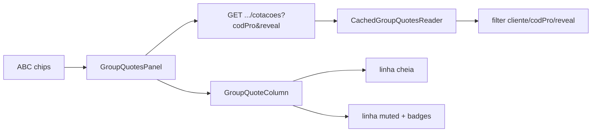

# Overview Customer — Coluna de cotações por produto — Design

**Spec**: `.specs/features/overview-customer-group-quote-column/spec.md`
**Context**: `.specs/features/overview-customer-group-quote-column/context.md`
**Status**: Approved
**Issues**: [#157](https://github.com/Gabr1elaugus700/WorkaPool/issues/157), [#158](https://github.com/Gabr1elaugus700/WorkaPool/issues/158)

---

## Architecture Overview

Uma leitura Sapiens por grupo (janela 12 dias, `sitped` 9/5) entra no cache em memória. Cliente, `codPro` e revelar são filtros sobre o cache. A ficha mantém chips ABC e substitui os dois cards por uma coluna de itens.

---

## Backend (#157)

| Piece | Change |
| ----- | ------ |
| `filterOverviewCustomerGroupQuoteLines` | `revealOtherCustomers` inclui outros `codcli` do mesmo `codPro` |
| `mapOverviewCustomerGroupQuoteRow` | `otherCustomer`, `customerTradeName` (`apecli`), `repShortName` (`aperep`) |
| `GetOverviewCustomerGroupQuotesUseCase` | `reveal` só para `ADMIN`/`GERENTE_DPTO`; `VENDAS` ignora |
| Controller | query `reveal=true\|1` |

Sem mudança no SQL/reader: o cache já traz todos os clientes do grupo.

---

## Frontend (#158)

| Component | Role |
| --------- | ---- |
| `OverviewCustomerGroupQuotesPanel` | Hook + estado produto/revelar + role |
| `OverviewCustomerGroupQuoteColumn` | Presentacional: loading/empty/error/lista |
| `OverviewCustomerGroupQuoteProductSelector` | `<select>` nativo |
| `OverviewCustomerGroupQuoteRowView` | Linha própria (cheia) vs revelada (muted + badges) |

Wire: `OverviewCustomerDetailOverviewPanel` troca `GroupAnalysisCards` pelo panel. Chips permanecem.

### UI (Impeccable Operate)

- Loading: skeleton; sem empty copy em voo.
- Própria ganha/perdida: `primary` / `destructive` saturados; sem badges.
- Revelada: muted + badge outcome saturado + badge azul `{codRep} {sellerName\|repShortName\|codRep}`.
- Botão revelar só `ADMIN`/`GERENTE_DPTO`.

---

## Risks

| Concern | Mitigation |
| ------- | ---------- |
| Reveal dispara Sapiens de novo | Filtro pós-cache; testes assertam `callCount === 1` |
| VENDAS pede reveal | Use-case ignora; UI esconde botão |
