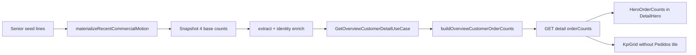

# Overview Customer — Contagens no hero — Design

**Spec**: `.specs/features/overview-customer-hero-order-counts/spec.md`
**Context**: `.specs/features/overview-customer-hero-order-counts/context.md`
**Status**: Approved

---

## Architecture Overview

Extend the existing overnight **recent-commercial-motion** materializer with four base order counts. The detail GET maps those bases into `orderCounts` (derived totals). The hero renders a 3×2 matrix; the Visão Geral KPI tile “Pedidos (desde Jan/2024)” is removed to avoid duplication.



No live Senior on GET. Snapshots missing new fields default to `0`.

---

## Code Reuse

| Existing | Role |
| -------- | ---- |
| `materializeOverviewCustomerRecentCommercialMotion.ts` | Same invoiced/lost rules as 12m counters; add Jan/2024 + 60d cutoffs |
| `extractOverviewCustomerRecentCommercialMotionSnapshot.ts` / identity extract | Default missing ints to 0; merge onto identity |
| `GetOverviewCustomerDetailUseCase.ts` | Expose `orderCounts` |
| `OverviewCustomerDetailHero.tsx` | 3-zone layout (identity \| counts \| health) |
| `OverviewCustomerKpiGrid.tsx` | Remove Pedidos tile only |
| `formatOverviewNumber` | Display formatting |

---

## Components

| Component | Location | Responsibility |
| --------- | -------- | -------------- |
| Motion model fields | `OverviewCustomerIdentity.ts` | Persist 4 base counts on motion snapshot type |
| Materializer | `materializeOverviewCustomerRecentCommercialMotion.ts` | Compute + write 4 bases |
| OrderCounts mapper | `utils/buildOverviewCustomerOrderCounts.ts` | Map bases → API DTO + derived totals |
| Detail use-case | `GetOverviewCustomerDetailUseCase.ts` | Attach `orderCounts` to result |
| FE types + resolve util | `overviewCustomerDetail.types.ts`, `overviewCustomerOrderCounts.utils.ts` | Contract + absent→0 |
| `OverviewCustomerHeroOrderCounts` | `components/detail/` | 3×2 matrix UI |
| Hero + DetailView | wire props | Place block; pass data |
| KpiGrid | remove Pedidos tile | Anti-duplication |

---

## Data Model (API)

```typescript
orderCounts: {
  invoicedSinceJan2024: number;
  lostSinceJan2024: number;
  totalSinceJan2024: number; // invoiced + lost
  invoicedLast60Days: number;
  lostLast60Days: number;
  totalLast60Days: number; // invoiced + lost
}
```

Snapshot bases (motion): `invoicedCountSinceJan2024`, `lostCountSinceJan2024`, `invoicedCountLast60Days`, `lostCountLast60Days`.

---

## Risks & Concerns

| Concern | Mitigation |
| ------- | ---------- |
| Snapshots published before this deploy lack new fields | Default missing bases to `0` in extract/mapper |
| Detail route tests importing Prisma `Role` can fail under bare `tsx --test` | Prefer pure mapper unit tests as primary gate; keep route assertions where the suite already loads cleanly |
| Ticket médio disappears with Pedidos tile | Accepted in context; not relocated this slice |

---

## Decisions Locked

- Totals derived at read time (not persisted).
- Materializer is the source of the four bases (mandatory step).
- KPI Pedidos tile removed; Movimentação 12m unchanged.
