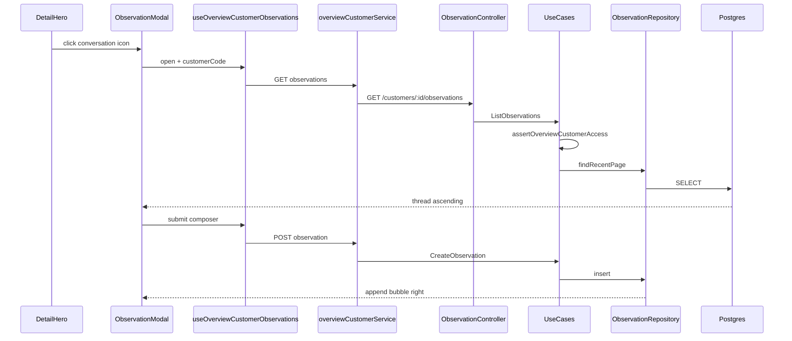

# Overview Customer — Histórico de observações — Design

**Spec**: `.specs/features/overview-customer-observation-chat/spec.md`
**Context**: `.specs/features/overview-customer-observation-chat/context.md`
**Status**: Approved

---

## Architecture Overview

New Postgres table for internal customer observations. Three REST endpoints under the existing overview customer router. Frontend modal (Grok/WhatsApp bubbles) opened from a conversation icon on the detail hero.



No Sapiens calls. No WebSocket. GET on modal open; POST/PATCH success refreshes thread.

---

## Code Reuse

| Existing | Role |
| -------- | ---- |
| `GetOverviewCustomerDetailUseCase.ts` | Source pattern for role + snapshot + `primaryCodRep` access |
| `OverviewCustomerSyncRepository` / `InMemoryOverviewCustomerSyncStore` | Customer existence via served snapshot |
| `overviewCustomerDetailRoutes.ts` | Mount GET/POST/PATCH observation routes |
| `OverviewCustomerDetailController.ts` | Extend or sibling controller for observation handlers |
| `OverviewCustomerDetailHero.tsx` | Conversation icon placement beside `tradeName` |
| `components/ui/dialog.tsx` | Modal shell |
| `components/ui/scroll-area.tsx` | Scrollable thread |
| `OrderDetailsModal.tsx` | Dialog + ScrollArea pattern reference |
| `LossReasonForm.tsx` | Textarea composer pattern (char limit, disable submit) |
| `formatIsoDateLabel` / pt-BR formatters | Timestamps on bubbles |

---

## Components

| Component | Location | Responsibility |
| --------- | -------- | -------------- |
| Prisma model | `backend/prisma/schema.prisma` | `OverviewCustomerObservation` table |
| Repository | `backend/src/features/overviewCustomer/repositories/OverviewCustomerObservationRepository.ts` | Paginated list, create, update-by-author |
| Access helper | `backend/src/features/overviewCustomer/utils/assertOverviewCustomerAccess.ts` | Shared role/snapshot/codRep gate |
| List use case | `useCases/ListOverviewCustomerObservationsUseCase.ts` | 50 newest, cursor `before`, author display name |
| Create use case | `useCases/CreateOverviewCustomerObservationUseCase.ts` | Validate body, persist |
| Update use case | `useCases/UpdateOverviewCustomerObservationUseCase.ts` | Author-only PATCH, set `editedAt` |
| HTTP routes | `http/routes/overviewCustomerDetailRoutes.ts` | GET/POST/PATCH wiring |
| OpenAPI | `http/overviewCustomer.contracts.ts` | Schemas and paths |
| FE types | `types/overviewCustomerObservation.types.ts` | DTOs |
| Service | `services/overviewCustomerService.ts` | HTTP client methods |
| Hook | `hooks/useOverviewCustomerObservations.ts` | Modal state, fetch, submit, pagination |
| Bubble | `components/detail/observations/OverviewCustomerObservationBubble.tsx` | Left/right bubble layout |
| Thread | `components/detail/observations/OverviewCustomerObservationThread.tsx` | Scroll, empty state, load older |
| Composer | `components/detail/observations/OverviewCustomerObservationComposer.tsx` | Enter submit, Shift+Enter newline |
| Modal | `components/detail/observations/OverviewCustomerObservationModal.tsx` | Dialog orchestration |
| Hero | `OverviewCustomerDetailHero.tsx` | Icon button + modal trigger |

---

## Data Model

### Prisma

```prisma
model OverviewCustomerObservation {
  id           String   @id @default(uuid())
  customerCode Int
  authorUserId String
  body         String   @db.VarChar(2000)
  createdAt    DateTime @default(now())
  updatedAt    DateTime @updatedAt
  editedAt     DateTime?

  author User @relation(fields: [authorUserId], references: [id])

  @@index([customerCode, createdAt, id])
  @@map("overview_customer_observation")
}
```

### API DTO (list item)

```typescript
{
  id: string;
  customerCode: number;
  authorUserId: string;
  authorDisplayName: string; // User.name || User.user
  body: string;
  createdAt: string;
  updatedAt: string;
  editedAt: string | null;
}
```

### Endpoints

| Method | Path | Purpose |
| ------ | ---- | ------- |
| GET | `/api/overview/customers/:clienteId/observations?before=<cursor>` | Newest page (50), ascending payload |
| POST | `/api/overview/customers/:clienteId/observations` | Create observation |
| PATCH | `/api/overview/customers/:clienteId/observations/:observationId` | Author edit |

Cursor `before`: composite `{ createdAt, id }` of oldest loaded item.

### Error codes

| Code | HTTP |
| ---- | ---- |
| `OVERVIEW_CUSTOMER_FORBIDDEN` | 403 |
| `OVERVIEW_CUSTOMER_NOT_FOUND` | 404 |
| `OBSERVATION_INVALID_BODY` | 400 |
| `OBSERVATION_EDIT_FORBIDDEN` | 403 |
| `OBSERVATION_NOT_FOUND` | 404 |

---

## UI Decisions

- Icon: `MessageSquare` (lucide), beside `tradeName`, `aria-label="Histórico de observações"`, no badge.
- Bubble alignment: right only when `authorUserId === currentUser.id`.
- Composer fixed at modal bottom; thread scrolls above.
- Empty copy: `Nenhuma observação neste cliente`.
- Edited copy: `editado` when `editedAt != null`.
- Re-fetch thread on each modal open (no stale cache).

---

## Risks & Concerns

| Concern | Mitigation |
| ------- | ---------- |
| Access check duplicated across 8+ overview use cases | Extract `assertOverviewCustomerAccess`; refactor detail use case only in T3 |
| No existing chat bubble components | Small dedicated components under `observations/` |
| Scroll jump when prepending older page | Save `scrollHeight` before prepend, restore scroll offset |
| Prisma migration in dev | Apply against local Postgres `:5435`; entity-only gate for T1 |
