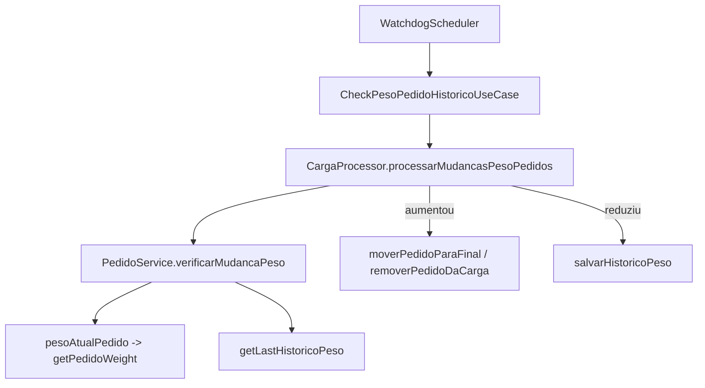

# Peso do Pedido / Reposicionamento - Spec de Test Cases

> Cenário de origem: pedidos com peso alterado não mudam de posição na carga e a tabela `HistoricoPesoPedidos` recebe vários registros com o mesmo peso (o primeiro peso salvo).
> Spec técnica da correção: [spec-tecnica.md](./spec-tecnica.md)

## Objetivo

Definir os casos de teste que **reproduzem o bug atual** e **garantem a correção** do fluxo de verificação de peso e reposicionamento de pedidos executado pelo watchdog.

Os testes devem falhar no código atual (ou provar o comportamento incorreto) e passar após aplicar a spec técnica.

## Contexto do fluxo sob teste

Unidades e arquivos envolvidos:

- [backend/src/features/pedidos/mappers/PedidoMapper.ts](../../../backend/src/features/pedidos/mappers/PedidoMapper.ts) - `mapRawToPedidos` (agregação de peso por pedido)
- [backend/src/features/pedidos/services/PedidoService.ts](../../../backend/src/features/pedidos/services/PedidoService.ts) - `verificarMudancaPeso`
- [backend/src/features/cargo/services/CargaProcessor.ts](../../../backend/src/features/cargo/services/CargaProcessor.ts) - `processarMudancasPesoPedidos`
- [backend/src/features/pedidos/repositories/PedidosRepository.ts](../../../backend/src/features/pedidos/repositories/PedidosRepository.ts) - `getPedidoWeight` (agregação lida do SQL)

## Convenções de teste (padrão do projeto)

- Runner: `node:test` (`describe`, `it`, `mock`, `after`), asserts com `node:assert/strict`.
- Localização: `backend/test/unit/features/**`.
- Mock de repositório via objeto que implementa `IPedidosRepository`/`ICargoRepository` com `mock.fn`, castado com `as any` (mesmo padrão de [PedidoProcessor.test.ts](../../../backend/test/unit/features/cargo/services/PedidoProcessor.test.ts) e [CloseCargaUseCase.test.ts](../../../backend/test/unit/features/cargo/useCases/CloseCargaUseCase.test.ts)).
- Bloco `after` aguardando ticks/timeout para drenar promises pendentes (mesmo padrão dos testes atuais).
- Proibido `any` em código de produção; nos testes segue-se o padrão existente de `as any` apenas para montar mocks parciais.

## Arquivos de teste a criar

| Arquivo | Unidade sob teste | Causa raiz coberta |
| --- | --- | --- |
| `backend/test/unit/features/pedidos/mappers/PedidoMapper.test.ts` | `mapRawToPedidos` | Causa 1 (agregação de peso) |
| `backend/test/unit/features/pedidos/services/PedidoService.verificarMudancaPeso.test.ts` | `PedidoService.verificarMudancaPeso` | Causas 1 e 2 (detecção de mudança / arredondamento) |
| `backend/test/unit/features/cargo/services/CargaProcessor.reposicionamento.test.ts` | `CargaProcessor.processarMudancasPesoPedidos` | Reposicionamento e persistência de histórico |

## Suítes e Test Cases

### TC-G1 — `mapRawToPedidos` agrega peso de múltiplas linhas

**Unidade**: `mapRawToPedidos`
**Motivo**: prova que a agregação correta (soma de todas as linhas por produto/derivação) é a referência que `getPedidoWeight` deve seguir.

| ID | Given | When | Then |
| --- | --- | --- | --- |
| TC-G1.1 | 3 linhas do mesmo `NUM_PED` com `PESO` 100, 250 e 150 | chamar `mapRawToPedidos(rows)` | retorna 1 pedido com `peso === 500` |
| TC-G1.2 | linhas de 2 pedidos distintos, cada um com múltiplas derivações | chamar `mapRawToPedidos(rows)` | retorna 2 pedidos, cada `peso` = soma das suas linhas |
| TC-G1.3 | 1 linha única para um pedido | chamar `mapRawToPedidos(rows)` | `peso` igual ao único `PESO` da linha |
| TC-G1.4 | linhas com `PESO` fracionário (ex.: 100.4 + 100.4) | chamar `mapRawToPedidos(rows)` | `peso` soma bruta (200.8), sem arredondar no mapper |

### TC-S1 — `verificarMudancaPeso` detecta mudança com peso agregado

**Unidade**: `PedidoService.verificarMudancaPeso`
**Setup**: mock de `IPedidosRepository` com `getPedidoWeight` e `getLastHistoricoPeso`.

> Observação: hoje `pesoAtualPedido` usa `getPedidoWeight`, que retorna peso parcial. Estes testes fixam o **contrato esperado**: `getPedidoWeight` retorna o peso total agregado.

| ID | Given | When | Then |
| --- | --- | --- | --- |
| TC-S1.1 | `getPedidoWeight` retorna peso total `500`; histórico anterior `peso: 400` | `verificarMudancaPeso(pedido)` | `{ mudou: true, aumentou: true, reducao: false, pesoAnterior: 400, pesoAtual: 500, diferenca: 100 }` |
| TC-S1.2 | peso total atual `300`; histórico `peso: 500` | `verificarMudancaPeso(pedido)` | `{ mudou: true, aumentou: false, reducao: true, diferenca: -200 }` |
| TC-S1.3 | peso total atual `500`; histórico `peso: 500` | `verificarMudancaPeso(pedido)` | `{ mudou: false, aumentou: false, reducao: false, diferenca: 0 }` |
| TC-S1.4 | peso total atual `500`; `getLastHistoricoPeso` retorna `null` | `verificarMudancaPeso(pedido)` | `{ mudou: false, pesoAnterior: null, pesoAtual: 500 }` (branch de histórico inicial) |

### TC-S2 — `verificarMudancaPeso` não gera mudança falsa por arredondamento

**Unidade**: `PedidoService.verificarMudancaPeso`
**Motivo**: cobre a Causa 2. Histórico é gravado com `Math.round`, mas a comparação usa o valor bruto do SQL. Estes testes fixam que peso atual e histórico devem ser comparados na **mesma granularidade**.

| ID | Given | When | Then |
| --- | --- | --- | --- |
| TC-S2.1 | peso atual `1234.6` (bruto do SQL); histórico `1235` (arredondado) | `verificarMudancaPeso(pedido)` | `mudou === false` (não pode disparar reprocessamento a cada ciclo) |
| TC-S2.2 | peso atual `1234.4`; histórico `1234` | `verificarMudancaPeso(pedido)` | `mudou === false` |
| TC-S2.3 | peso atual `1240.0`; histórico `1234` | `verificarMudancaPeso(pedido)` | `mudou === true`, `aumentou === true` (mudança real acima do arredondamento) |

> Falha esperada no código atual: TC-S2.1 e TC-S2.2 retornam `mudou: true` hoje, evidenciando os históricos repetidos.

### TC-P1 — `CargaProcessor` reposiciona quando o peso aumenta e cabe

**Unidade**: `CargaProcessor.processarMudancasPesoPedidos`
**Setup**: mock de `ICargoRepository` (`getPedidosPorCarga`, `updatePedidoCarga`), `PedidoService` (`verificarMudancaPeso`, `salvarHistoricoPeso`) e `PesoCargaCalculator` (`simularNovoPeso`, `calculaPesoDisponivel`).

| ID | Given | When | Then |
| --- | --- | --- | --- |
| TC-P1.1 | 1 pedido com `verificarMudancaPeso` = `{ mudou: true, aumentou: true, pesoAnterior: 400, pesoAtual: 500 }` e `simularNovoPeso` = `{ cabeNaCarga: true }` | `processarMudancasPesoPedidos(carga)` | chama `updatePedidoCarga` com nova `poscar` (maxPosCar+1); `salvarHistoricoPeso` chamado 1x com `500`; retorno inclui o pedido em `pedidosReposicionados` |
| TC-P1.2 | igual acima, mas `simularNovoPeso` = `{ cabeNaCarga: false, excesso: 120 }` | `processarMudancasPesoPedidos(carga)` | chama `updatePedidoCarga(numPed, 0, 0)` (remoção); pedido em `pedidosRemovidos`; `salvarHistoricoPeso` chamado 1x com `500` |
| TC-P1.3 | `verificarMudancaPeso` = `{ mudou: true, reducao: true, pesoAnterior: 500, pesoAtual: 300 }` | `processarMudancasPesoPedidos(carga)` | **não** chama reposicionamento nem remoção; `salvarHistoricoPeso` chamado 1x com `300` |
| TC-P1.4 | `verificarMudancaPeso` = `{ mudou: false }` | `processarMudancasPesoPedidos(carga)` | nenhum `updatePedidoCarga` e nenhum `salvarHistoricoPeso` |
| TC-P1.5 | `verificarMudancaPeso` = `{ pesoAnterior: null }` | `processarMudancasPesoPedidos(carga)` | `salvarHistoricoPeso` chamado 1x (registro inicial); pedido em `pedidosSemHistorico`; sem reposicionamento |

### TC-P2 — `moverPedidoParaFinal` calcula posição corretamente

**Unidade**: `CargaProcessor` (efeito de `moverPedidoParaFinal` via reposicionamento)

| ID | Given | When | Then |
| --- | --- | --- | --- |
| TC-P2.1 | carga com pedidos em `poscar` 1, 2, 5 | reposicionamento de um pedido | `updatePedidoCarga` recebe `poscar === 6` (maior + 1) |
| TC-P2.2 | carga sem pedidos com `poscar` (todos `null`/0) | reposicionamento de um pedido | `updatePedidoCarga` recebe `poscar === 1` |

## Estratégia de mocks

- `IPedidosRepository`: `getPedidoWeight`, `getLastHistoricoPeso`, `createHistoricoPeso` como `mock.fn`.
- `ICargoRepository`: `getPedidosPorCarga`, `updatePedidoCarga` como `mock.fn`.
- `PesoCargaCalculator`: instância real não é usada nos testes de `CargaProcessor`; injeta-se um objeto `mock` com `simularNovoPeso` e `calculaPesoDisponivel`.
- `PedidoService` nos testes de `CargaProcessor`: objeto `mock` com `verificarMudancaPeso` e `salvarHistoricoPeso`.
- Nenhum teste deve tocar SQL Server real nem Prisma; `getPedidoWeight` como acesso a SQL é validado indiretamente por `mapRawToPedidos` (TC-G1) mais verificação manual/integração descrita na spec técnica.

## Requisitos de rastreabilidade

| Test ID | Causa raiz | Story relacionada (spec técnica) |
| --- | --- | --- |
| TC-G1.* | Causa 1 - agregação de peso | FIX-01 |
| TC-S1.* | Causa 1 - detecção de mudança | FIX-01 |
| TC-S2.* | Causa 2 - arredondamento | FIX-02 |
| TC-P1.* | Reposicionamento/persistência | FIX-01, FIX-02 |
| TC-P2.* | Cálculo de posição | FIX-01 |

## Critérios de aceite dos testes

1. Todos os TCs acima existem nos arquivos indicados e rodam em `node:test`.
2. TC-S2.1 e TC-S2.2 falham no código atual e passam após a spec técnica (prova de correção da Causa 2).
3. TC-S1.1 e TC-P1.1 comprovam que peso agregado leva a `aumentou: true` e a reposicionamento (prova de correção da Causa 1).
4. Nenhum teste depende de banco/SQL externo (100% unitário com mocks).
5. Suíte completa executa sem promises pendentes (bloco `after` presente).
