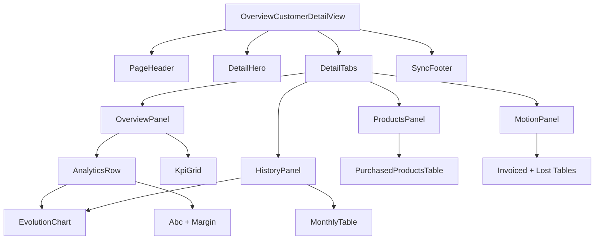

# Decomposição de Componentes — Overview Customer Detail

## Árvore proposta

```
OverviewCustomerDetailView (view — orquestração)
├── OverviewCustomerDetailPageHeader
├── OverviewCustomerDetailHero
├── OverviewCustomerDetailTabs
│   ├── [tab=overview] OverviewCustomerDetailOverviewPanel
│   │   ├── OverviewCustomerKpiGrid
│   │   │   └── OverviewCustomerKpiTile × 6
│   │   ├── OverviewCustomerAnalyticsRow
│   │   │   ├── OverviewCustomerMonthlyEvolutionChart
│   │   │   └── OverviewCustomerAnalyticsSidecars
│   │   │       ├── OverviewCustomerAbcConcentrationCard
│   │   │       └── OverviewCustomerMarginRangeCard
│   │   └── OverviewCustomerRecentOrdersTeaser
│   ├── [tab=history] OverviewCustomerDetailHistoryPanel
│   │   ├── OverviewCustomerMonthlyEvolutionChart (full)
│   │   └── OverviewCustomerMonthlyEvolutionTable
│   ├── [tab=products] OverviewCustomerDetailProductsPanel
│   │   ├── OverviewCustomerProductsToolbar (search + count)
│   │   └── OverviewCustomerPurchasedProductsTable
│   └── [tab=motion] OverviewCustomerDetailMotionPanel
│       ├── OverviewCustomerCommercialMotionSummary
│       ├── OverviewCustomerRecentInvoicedOrdersTable
│       └── OverviewCustomerRecentLostOrdersTable
└── OverviewCustomerDetailSyncFooter

Estados globais (permanecem na view):
├── OverviewCustomerAccessDeniedState
├── OverviewCustomerSectionCard + OverviewCustomerStateMessage (erro/loading first paint)
```

## Mapa arquivo → responsabilidade

Todos os novos componentes ficam em:

```
frontend/src/features/overviewCustomer/components/detail/
```

| Arquivo | Responsabilidade única | Export |
|---------|------------------------|--------|
| `OverviewCustomerDetailPageHeader.tsx` | Breadcrumb, título da superfície, botão voltar, slot opcional de ações | 1 componente |
| `OverviewCustomerDetailHero.tsx` | Identidade visual premium: avatar/iniciais, nome, badges filial/segmento, metadados | 1 componente |
| `OverviewCustomerDetailTabs.tsx` | Tablist acessível + painéis; recebe `activeTab` e `onTabChange` controlados pela view | 1 componente |
| `overviewCustomerDetailTabs.constants.ts` | IDs e labels das abas | 1 const object |
| `OverviewCustomerKpiGrid.tsx` | Layout responsivo do grid de KPIs | 1 componente |
| `OverviewCustomerKpiTile.tsx` | Tile individual: label, valor, subtexto comparativo opcional | 1 componente |
| `OverviewCustomerDetailOverviewPanel.tsx` | Composição da aba Visão Geral | 1 componente |
| `OverviewCustomerAnalyticsRow.tsx` | Grid 2 colunas chart + sidecars | 1 componente |
| `OverviewCustomerMonthlyEvolutionChart.tsx` | Gráfico Recharts combinado | 1 componente |
| `OverviewCustomerAbcConcentrationCard.tsx` | Top 5 produtos com barra de share | 1 componente |
| `OverviewCustomerMarginRangeCard.tsx` | Min / média / max de margem | 1 componente |
| `OverviewCustomerMonthlyEvolutionTable.tsx` | Tabela mensal (extrair de section atual) | 1 componente |
| `OverviewCustomerDetailHistoryPanel.tsx` | Composição aba Histórico | 1 componente |
| `OverviewCustomerProductsToolbar.tsx` | Busca + badge contagem | 1 componente |
| `OverviewCustomerPurchasedProductsTable.tsx` | Tabela densa de produtos | 1 componente |
| `OverviewCustomerDetailProductsPanel.tsx` | Composição aba Produtos | 1 componente |
| `OverviewCustomerCommercialMotionSummary.tsx` | 3 datas-chave (dl compacto) | 1 componente |
| `OverviewCustomerRecentInvoicedOrdersTable.tsx` | Tabela pedidos faturados | 1 componente |
| `OverviewCustomerRecentLostOrdersTable.tsx` | Tabela pedidos perdidos | 1 componente |
| `OverviewCustomerDetailMotionPanel.tsx` | Composição aba Movimentação | 1 componente |
| `OverviewCustomerRecentOrdersTeaser.tsx` | Preview 3 pedidos + link | 1 componente |
| `OverviewCustomerDetailSyncFooter.tsx` | Linha de sync freshness | 1 componente |

## Utils derivados (opcional, fase 2)

| Arquivo | Função |
|---------|--------|
| `utils/overviewCustomerAnalytics.utils.ts` | `buildAbcRows(products)`, `computeMarginRange(products \| monthly)` |
| `utils/overviewCustomerDetailTabs.utils.ts` | `shouldFetchMonthly(tab)`, `shouldFetchProducts(tab)` |

Regra: funções puras, sem React; testáveis isoladamente.

## View refatorada (pseudo-estrutura)

```tsx
// OverviewCustomerDetailView.tsx — alvo ~80–100 linhas
export function OverviewCustomerDetailView() {
  // params, customerCode, queries (igual hoje)
  const [activeTab, setActiveTab] = useState<OverviewCustomerDetailTabId>("overview");

  const shouldLoadMonthly = activeTab === "overview" || activeTab === "history";
  const shouldLoadProducts = activeTab === "overview" || activeTab === "products";
  const shouldLoadMotion = activeTab === "overview" || activeTab === "motion";

  // monthlyQuery enabled: shouldLoadMonthly
  // purchasedProductsQuery enabled: shouldLoadProducts
  // recentCommercialMotionQuery enabled: shouldLoadMotion

  // early returns: invalid, loading, error, denied, not found

  return (
    <DefaultLayout>
      <div className="mx-auto flex w-full max-w-[1400px] flex-col gap-4 px-3 py-6 md:px-6">
        <OverviewCustomerDetailPageHeader customerCode={...} tradeName={...} />
        <OverviewCustomerDetailHero customer={detail.customer} />
        <OverviewCustomerDetailTabs
          activeTab={activeTab}
          onTabChange={setActiveTab}
          productCount={purchasedProductsQuery.data?.products.length}
          overviewPanel={...}
          historyPanel={...}
          productsPanel={...}
          motionPanel={...}
        />
        <OverviewCustomerDetailSyncFooter lastSyncAt={detail.sync.lastSuccessfulSyncAt} />
      </div>
    </DefaultLayout>
  );
}
```

## Componentes compartilhados existentes — reuso

| Primitivo | Uso |
|-----------|-----|
| `OverviewCustomerSectionCard` | Wrapper de chart, tabelas, sidecars |
| `OverviewCustomerStateMessage` | Loading/error/empty dentro de painéis |
| `@/components/ui/card`, `badge`, `button`, `table`, `tabs`, `input` | shadcn |
| `@/components/ui/chart` | ChartContainer, tooltip, legend |
| `overviewCustomerFormatters` | Toda formatação numérica |

## O que NÃO extrair

- Lógica de parse `clienteId` — permanece na view (ou `utils/overviewCustomerRoute.utils.ts` se já existir padrão).
- Hooks de fetch — permanecem em `hooks/`; view pode passar `enabled` via react-query options nos hooks (ajuste incremental).

## Convenção de nomes

- Prefixo `OverviewCustomerDetail*` para peças exclusivas da tela de detalhe.
- Prefixo `OverviewCustomer*` para peças reutilizáveis na feature (KPI tile pode servir listagem futura).
- Evitar sufixos genéricos `Section`, `Card2`, `Helper`.

## Dependências entre componentes



## Migração incremental (sem big bang)

1. Criar pasta `detail/` com Header + Hero + Tabs vazias renderizando conteúdo legado dentro da aba default.
2. Introduzir KPI grid; remover `CommercialSummaryCard` da view.
3. Mover seções existentes para painéis de aba correspondente.
4. Extrair chart e sidecars.
5. Deletar componentes legados quando testes migrarem.
